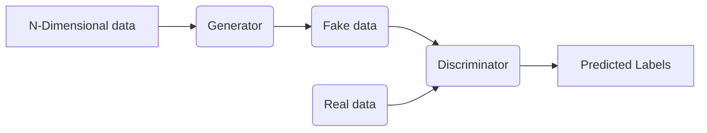

# Project

This project is implementation of **Deep convolutional Generative Adversial Networks(DCGAN)** and train them using **Keras API with Tensorflow 2.0 Backend**

**Dataset:** Fashion MNIST [It contains grayscale images of fashion items, each image is 2828 pixels and there are 10 classes in total]

## Introduciton

Generator is responsible for creating new data samples, while the discriminator's task is to distinguish between real data and fake data generated by the generator. There is Adversial training process between two, where generator improves its ability to create realistic samples while the discriminator becomes better at Identifying real from fake


### Key components of DCGAN
```
    1. Generator
    2. Discriminator
    3. Latent space
    4. Training Loop
    5. Loss Function
```

### Tasks
```
    Task 1: Import Libraries
    Task 2: the Fashion MNIST Data preprocessing
    Task 3: Create Batches of training data (shuffle to add more randomness)
    Task 4: Build the Generator Network for DCGAN
    Task 5: Build the Discriminator Network for DCGAN
    Task 6: Compile the Deep Convolutional Generative Adversarial Network (DCGAN)
    Task 7: Define the Training Procedure
    Task 8: Train DCGAN
    Task 9: Generate Synthetic Images with DCGAN
```


## DCGAN generated images gif

